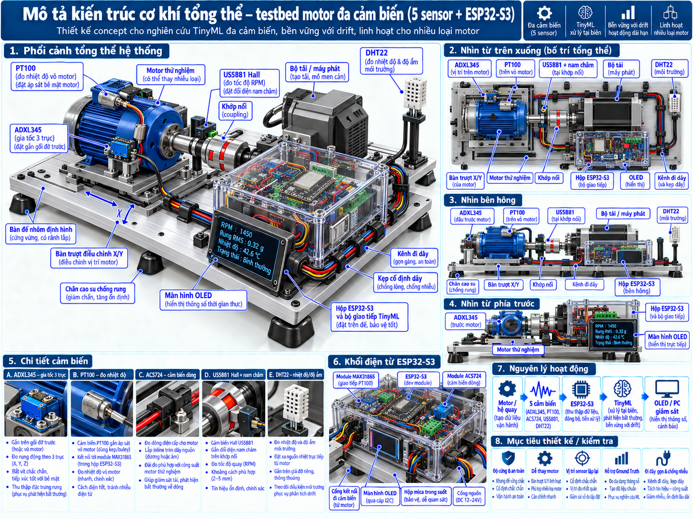
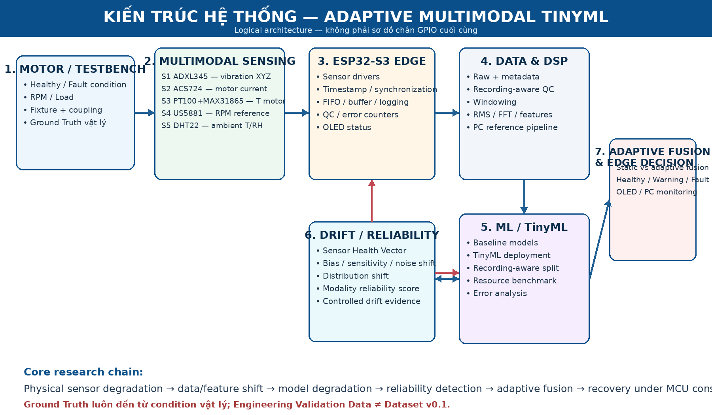
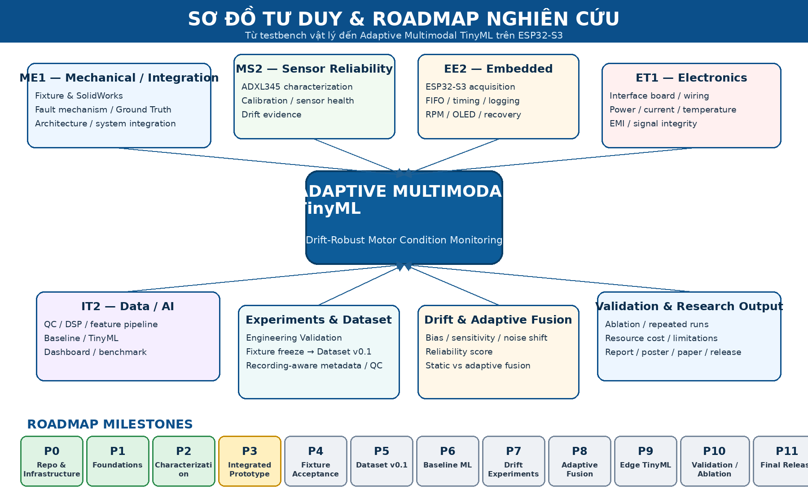

# Adaptive Multimodal TinyML for Drift-Robust Predictive Maintenance

**HUST Research Team — NCKH / SVNCKH**

> Research repository for **Adaptive Multimodal TinyML for Drift-Robust Predictive Maintenance on Resource-Constrained Edge Microcontrollers**

Repository này dùng xuyên suốt toàn bộ dự án: từ concept → cơ khí → điện tử → firmware → experiment → dataset → ML/TinyML → drift → adaptive fusion → validation → báo cáo/paper/final release.

---

## Project Model



> **Concept illustration.** Hình dùng để thống nhất bố trí hệ thống, vị trí sensor, hộp ESP32-S3 và OLED; không thay thế drawing gia công hoặc wiring/pinout đã nghiệm thu.

---

## 1. Project Goal

Xây dựng hệ thống giám sát tình trạng thiết bị điện–cơ đa cảm biến trên **ESP32-S3**, với mục tiêu:

- đo rung, dòng điện, nhiệt độ và điều kiện vận hành;
- phát hiện/phân loại trạng thái lỗi;
- đánh giá sensor reliability;
- phát hiện sensor drift / distribution shift;
- sử dụng adaptive multimodal fusion khi một modality giảm chất lượng;
- triển khai trong giới hạn RAM, Flash, latency và tài nguyên của MCU.

Chuỗi nghiên cứu:

```text
Physical sensor degradation
        ↓
Data / feature distribution shift
        ↓
TinyML model degradation
        ↓
Drift / reliability detection
        ↓
Adaptive multimodal fusion / lightweight adaptation
        ↓
Performance recovery under MCU constraints
```

Trọng tâm hiện tại là **condition monitoring / fault diagnosis**; prognosis/RUL là hướng mở rộng sau.

---

## 2. System Configuration

| ID | Sensor / Module | Vai trò |
|---|---|---|
| S1 | **ADXL345** | Vibration / acceleration XYZ |
| S2 | **ACS724** | Motor current |
| S3 | **PT100 + MAX31865** | Motor housing temperature |
| S4 | **US5881 Hall + magnet** | RPM reference |
| S5 | **DHT22** | Ambient temperature / humidity |
| MCU | **ESP32-S3** | Acquisition / edge processing / TinyML |
| Display | **OLED** | Local status / monitoring |

Ba modality chính:

```text
Vibration + Current + Motor Temperature
```

RPM là operating-condition/reference signal.  
DHT22 là environmental context cho thermal/drift characterization.

---

## 3. System Architecture



> Đây là **logical architecture**. GPIO/pin mapping cuối cùng phải được xác nhận theo board ESP32-S3 và wiring thực tế trước khi chế tạo.

---

## 4. Research Mind Map & Roadmap



### Roadmap status

| Phase | Milestone | Status |
|---|---|---|
| P0 | Repository & Infrastructure | ✅ Complete |
| P1 | Physics / Sensor Foundations | ✅ Complete |
| P2 | Characterization & First Experiments | ✅ Complete / iterative |
| P3 | Integrated Prototype | 🟡 In progress |
| P4 | Fixture Acceptance | ⚪ Planned |
| P5 | Dataset v0.1 | ⚪ Planned |
| P6 | Baseline ML | ⚪ Planned |
| P7 | Drift Experiments | ⚪ Planned |
| P8 | Adaptive Fusion | ⚪ Planned |
| P9 | Edge TinyML | ⚪ Planned |
| P10 | Validation / Ablation | ⚪ Planned |
| P11 | Final Research Release | ⚪ Planned |

README theo **roadmap/milestone**, không theo một tuần cụ thể.  
Kế hoạch từng tuần nằm trong `docs/plans/`.

---

## 5. Team Responsibilities

| ID | Vai trò | Primary folders |
|---|---|---|
| **ME1** | System Architecture / Mechanical Testbench / Ground Truth / Integration | `hardware/mechanical/`, `docs/architecture/`, `experiments/protocols/` |
| **MS2** | MEMS / ADXL345 / Calibration / Sensor Health / Drift | `experiments/sensor_characterization/`, `results/` |
| **EE2** | ESP32-S3 Firmware / Acquisition / Timing / Logging | `firmware/esp32s3/` |
| **ET1** | Electronics / Sensor Interface / Power / EMI | `hardware/electronics/` |
| **IT2** | Data / DSP / ML / TinyML / Dashboard | `ml/`, `software/`, `data/`, `results/` |

**Quy tắc:** code/artifact chính nằm theo subsystem, không theo tên thành viên. `members/` chỉ dùng cho note/draft/report cá nhân.

---

## 6. Repository Structure

```text
SVNCKH--HUST/
├── AGENTS.md                     # Codex project instructions
├── README.md
├── CONTRIBUTING.md
├── CHANGELOG.md
├── SETUP_GIT.md
├── .gitignore
├── .gitattributes
│
├── .github/
│   ├── ISSUE_TEMPLATE/
│   ├── PULL_REQUEST_TEMPLATE.md
│   ├── scripts/
│   └── workflows/
│
├── assets/
│   ├── system_images/
│   ├── experiment_photos/
│   ├── diagrams/
│   └── posters/
│
├── data/
│   ├── sample/
│   ├── manifests/
│   └── processed_sample/
│
├── docs/
│   ├── architecture/
│   ├── plans/
│   ├── reports/
│   ├── references/
│   └── project_management/
│
├── experiments/
│   ├── protocols/
│   ├── engineering_validation/
│   ├── sensor_characterization/
│   ├── fault_experiments/
│   └── metadata/
│
├── firmware/
│   └── esp32s3/
│       ├── drivers/
│       ├── acquisition/
│       ├── logging/
│       ├── dsp/
│       ├── oled/
│       └── tests/
│
├── hardware/
│   ├── mechanical/
│   ├── electronics/
│   └── bom/
│
├── ml/
├── software/
├── simulations/
├── results/
├── presentations/
└── members/
```

Chi tiết: `docs/project_management/REPOSITORY_STRUCTURE.md`.

---

# 7. Git Workflow — hiểu bằng ví dụ

```text
main
 ↑
dev
 ↑
feature/*
```

- `main` = milestone ổn định.
- `dev` = nơi tích hợp subsystem.
- `feature/*` = branch riêng của từng task.

Luồng chuẩn:

```text
Issue
→ Feature Branch
→ Work + Test
→ Commit
→ Push
→ Pull Request to dev
→ Codex Review
→ Fix / Re-review
→ Human Gate
→ Merge dev
→ Integration Test
→ dev → main
```

---

## 8. Ví dụ cụ thể cho ME1

### Task
Thiết kế `Fixture v0.1`.

### Folder

```text
hardware/mechanical/solidworks/parts/
hardware/mechanical/solidworks/assemblies/
hardware/mechanical/solidworks/drawings/
hardware/mechanical/step/
hardware/mechanical/dxf/
hardware/mechanical/fabrication/
hardware/bom/
```

### Branch

```bash
git switch dev
git pull origin dev
git switch -c feature/me1-fixture-v01
```

### Làm gì?

- SolidWorks assembly;
- motor plate điều chỉnh;
- coupling/load interface;
- vị trí ADXL345/PT100/Hall;
- cable clearance;
- drawing/STEP/DXF;
- BOM;
- Fixture Acceptance Checklist.

### Commit / push

```bash
git add .
git commit -m "feat(mechanical): add fixture v0.1 design"
git push -u origin feature/me1-fixture-v01
```

### PR

```text
base: dev
compare: feature/me1-fixture-v01
```

Codex review consistency/traceability; **ME1 vẫn phải human-review CAD và safety**.

---

## 9. Ví dụ cụ thể cho MS2

### Task
ADXL345 calibration + Sensor Health Vector.

### Folder

```text
experiments/sensor_characterization/
results/figures/
results/tables/
```

Nếu có code sensor:

```text
firmware/esp32s3/drivers/adxl345/
ml/drift_detection/
```

### Branch

```bash
git switch dev
git pull origin dev
git switch -c feature/ms2-sensor-health
```

### Output

- calibration routine;
- self-test evidence;
- bias/noise/repeatability plots;
- temperature characterization;
- Sensor Health Vector;
- drift evidence note.

### Commit

```bash
git add .
git commit -m "feat(sensor): add ADXL345 sensor-health analysis"
git push -u origin feature/ms2-sensor-health
```

Codex phải kiểm terminology, units, statistics và overclaim; không được tự biến proxy thành real drift.

---

## 10. Ví dụ cụ thể cho EE2

### Task
ADXL345 buffered acquisition.

### Folder

```text
firmware/esp32s3/drivers/adxl345/
firmware/esp32s3/acquisition/
firmware/esp32s3/logging/
firmware/esp32s3/tests/
```

### Branch

```bash
git switch dev
git pull origin dev
git switch -c feature/ee2-adxl345-acquisition
```

### Output

- driver;
- DATA_READY/FIFO nếu phù hợp;
- ring buffer;
- timestamp;
- sample index;
- error counters;
- recovery;
- stress-test log.

### Test evidence

Ví dụ:

```text
target fs:
duration:
expected sample count:
actual sample count:
dropped samples:
I2C errors:
timestamp gaps:
```

### Commit

```bash
git add .
git commit -m "feat(firmware): add ADXL345 buffered acquisition"
git push -u origin feature/ee2-adxl345-acquisition
```

Codex review timing/buffer/error handling; human hardware verification vẫn cần khi thay pin/interface.

---

## 11. Ví dụ cụ thể cho ET1

### Task
Sensor Interface Board / wiring v0.1.

### Folder

```text
hardware/electronics/schematics/
hardware/electronics/wiring/
hardware/electronics/interface_board/
hardware/bom/
```

### Branch

```bash
git switch dev
git pull origin dev
git switch -c feature/et1-interface-board
```

### Output

- schematic;
- connector/pinout;
- power rails;
- ground;
- pull-ups;
- ACS724 interface;
- PT100/MAX31865 interface;
- US5881 interface;
- EMI/cable-routing note.

### Commit

```bash
git add .
git commit -m "feat(electronics): add sensor interface board v0.1"
git push -u origin feature/et1-interface-board
```

Codex kiểm documentation consistency; **bench verification điện áp/dòng vẫn do ET1/ME1 chịu trách nhiệm**.

---

## 12. Ví dụ cụ thể cho IT2

### Task
Feature pipeline + live dashboard.

### Folder

```text
ml/preprocessing/
ml/features/
ml/notebooks/
software/serial_logger/
software/pc_dashboard/
results/
```

### Branch

```bash
git switch dev
git pull origin dev
git switch -c feature/it2-edge-dsp
```

### Output

- parser;
- QC;
- RMS/STD/peak/crest/kurtosis;
- FFT/band energy;
- PC reference DSP;
- ESP32 equivalence comparison;
- dashboard;
- benchmark.

### Commit

```bash
git add .
git commit -m "feat(ml): add reference DSP and feature pipeline"
git push -u origin feature/it2-edge-dsp
```

Codex phải kiểm **recording-level leakage, preprocessing leakage, metadata và reproducibility**.

---

# 13. Pull Request = nơi bàn giao task

Không coi `git push` là hoàn thành.

PR phải chứa:

```text
Goal
Files changed
How to run
Tests
Evidence
Data/Ground Truth impact
Dependencies
Codex review focus
Human gate
Merge checklist
```

Template đầy đủ:

```text
.github/PULL_REQUEST_TEMPLATE.md
```

Hướng dẫn từng bước:

```text
docs/project_management/PULL_REQUEST_GUIDE.md
```

---

# 14. Codex Agent Review

Repository có `AGENTS.md` ở root và các instruction riêng theo subsystem.

Codex được dùng làm **reviewer kỹ thuật vòng 1**:

```text
PR
→ Codex Review
→ Findings
→ Member Fix
→ Re-review
→ Human Gate
→ Merge
```

Codex phù hợp để kiểm:

- bug / regression;
- code correctness;
- timing/buffer logic;
- data leakage;
- reproducibility;
- schema consistency;
- docs/interface mismatch;
- repository hygiene.

Codex **không thay thế human final gate** cho:

- mechanical safety;
- electrical safety;
- Ground Truth;
- experiment protocol;
- dataset inclusion;
- architecture change;
- scientific claim;
- `dev → main`.

Xem:

```text
AGENTS.md
docs/project_management/CODEX_REVIEW_WORKFLOW.md
docs/project_management/CODEX_REVIEW_PROMPTS.md
```

---

# 15. Data Policy

Không commit raw dataset lớn.

GitHub giữ:

```text
data/sample/
data/manifests/
data/processed_sample/
```

Raw data lớn lưu ngoài repo.

Mỗi dataset phải truy vết:

```text
dataset_version
fixture_version
sensor_setup_version
firmware_commit
experiment_protocol
QC_status
```

**Engineering Validation Data ≠ Dataset v0.1.**

Dataset v0.1 chỉ bắt đầu sau:

```text
Fixture Acceptance Test
→ PASS
→ Freeze Fixture Version
→ Dataset v0.1
```

---

# 16. Commit Convention

```text
type(scope): message
```

Ví dụ:

```text
feat(firmware): add ADXL345 buffered acquisition
fix(firmware): handle I2C timeout
feat(mechanical): add fixture v0.1
feat(electronics): add PT100 interface
feat(ml): add FFT feature extraction
docs(architecture): update system architecture
data(metadata): update recording schema
```

Không dùng:

```text
update
final
final2
code moi
abc
```

---

# 17. Definition of Done

Task chỉ DONE khi:

```text
Artifact đúng folder
+
Version rõ
+
Test / Evidence
+
Commit
+
Push
+
Pull Request
+
Codex Review
+
Human Gate nếu cần
+
Merge dev
```

Milestone chỉ lên `main` sau integration test.

---

# 18. Research Quality Rules

- Không bịa measured result.
- Hypothesis ≠ conclusion.
- Ground Truth đến từ physical condition.
- Không suy label từ FFT/model.
- Phân biệt noise / drift / operating-condition shift / mounting-domain shift.
- Recording-aware split.
- Metadata đầy đủ.
- Report failure case.
- TinyML claim phải kèm resource cost.

---

# 19. Quick Start cho thành viên mới

### Lần đầu

```bash
git clone <REPO_URL>
cd SVNCKH--HUST
git switch dev
git pull origin dev
```

### Nhận task

Ví dụ EE2:

```bash
git switch -c feature/ee2-adxl345-acquisition
```

### Làm xong

```bash
git status
git add .
git commit -m "feat(firmware): add ADXL345 buffered acquisition"
git push -u origin feature/ee2-adxl345-acquisition
```

### Sau đó

```text
GitHub
→ Pull Requests
→ New Pull Request
→ base = dev
→ compare = feature/...
→ điền template
→ Codex review
→ sửa finding nếu có
→ human gate
→ merge
```

---

# 20. Repository = Technical Memory

```text
README = overview + roadmap
Issues = task management
Feature Branch = isolated work
Commits = traceable history
Pull Requests = review + evidence
Codex = first-pass technical review
dev = integrated development
main = stable milestones
Tags/Releases = project milestones
```

---

**HUST Research Team — Adaptive Multimodal TinyML**
